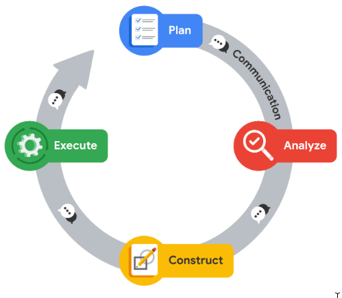

# Foundations of Data Science

[Back to Courses](./README.md)  

[Link to Course](https://www.coursera.org/learn/foundations-of-data-science/home/week/1)  

## Table of Contents
- [Careers in Data Science](#careers-in-data-science)
    - [Data Career Skills](#data-career-skills)
    - [Data Analytics Teams](#data-analytics-teams)
    - [RACI](#raci)
- [PACE](#pace)

## Course Objectives

- Describe data science and its functions within an organization
- Identify tools used by data professionals
- Articulate the value of data science in organizations
- Investigate career opportunities for a data professional
- Explore data professional workflow
- Develop effective communication skills

## Careers in Data Science

A *data professional* is a term used to describe any individual who works with data and/or has data skills.

To gain insights, businesses rely on data professionals to acquire, organize, and interpret data, which helps inform internal projects and processes. Businesses seek those who can access data and understand its metrics--the methods and criteria that data professionals use to evaluate data.

*Machine learning* is an alternative approach to automation expressing the way you want a task to be done by using data instead of explicit instructions. Machine learning techniques can be used for data analytics and exploration.

Data skills checklist:
- Statistics
- Scientific methods
- Data analysis
- Artificial intelligence

Data science is the discipline of making data useful.

**DATA SCIENCE vs DATA ANALYTICS**  

Data science and data analytics are distinct but related disciplines. Organizations often use these terms interchangeably.

| Discipline | Description | Outcomes |
| --- | --- | --- |
| Data Science | Discipline of making data more useful. A data scientist is a professional that uses raw data to develop new ways to model data and understand the unknown. | Produces broad insights that concentrate on which questions should be asked about data   Confronts what is unknown by using advanced techniques to make predictions about the future |
| Data Analysis | Data analytics is a field of study that falls under the larger discipline of data science. The aim of data analytics is to create methods to capture, process, and organize data to uncover actionable insights for current problems. | Emphasizes discovering answers to questions being asked    Determines actionable insights that can be applied immediately based on existing queries |

The *data analytics toolbox* includes:
- Programming languages like Python and R
- Jupyter and R notebooks
- Visualization tools like Tableau
- Storytelling

Careers in data can be broadly categorized into two groups:

| Data career category | E.g., Profession | Skills needed | Responsibilities |
| --- | --- | --- | --- |
| Technical | Machine Learning Engineers   Statisticians   Data analyst | Expertise in mathematics, statistics, and computing | Build models and make predictions   Explore data sets   Transform raw data into useful information for decision-making |
| Strategic | Business Intelligence Analyst   Technical Project Manager |  | Interpret information for an organization's operations, finance, research, and development   Work aligns with business strategy   Creates processes and information channels that transform relevant data |

A *nonprofit* is a group whose main purpose is to further a social cause or provide a benefit to the public. There are many opportunities for a data analysts to help nonprofits. [DataKind](https://www.datakind.org/) is an organization that harnesses the power of data and AI in service of humanity.

*Open data* is data that is available to the public and free to use, with guidance on how to navigate the datasets and acknowledge the source. 

**Responsible Data Usage**  

**DATA ETHICS**  

Data professionals need to protect privacy within data and remain aware of other considerations, like data bias and making assumptions about data. 

**Data ethics** refers to well-founded standards of right and wrong that dictate how data is collected, shared, and used.  

One element of treating data ethically is ensuring that the privacy and security of that data is maintained throughout its lifetime.

*Data privacy* means preserving a data subject’s information and activity any time a data transaction occurs. This is also called information privacy or data protection.

*Personally Identifiable Information*--or *PII*--is information that permits the identity of an individual to be inferred by either direct or indirect means. Types of PII include biometric records, usernames, and social security or other national identification numbers.

*Data anonymization* is the process of protecting people's private or sensitive data by eliminating PII. Typically, data anonymization involves blanking, hashing, or masking personal information, often by using fixed-length codes to represent data columns, or hiding data with altered values.

*Data aggregation* is the process of collecting and combining details from a significant number of users in terms of totals or summary. Aggregating data ensures that information contained within datasets is shown in groups; when coupled with other anonymization techniques, data professionals can ensure compliance with data privacy and anonymization standards.

Data analysts should ensure their sample represents the population being studied. A *sample* is a segment of a population that is representative of the entire population.

**DATA STEWARDSHIP**  

Data stewardship is the practice of ensuring that data is accessible, usable, and safe. Making data stewardship a normal part of your work habits will benefit everyone who relies on your analysis, both inside and outside of your organization. 

One of your responsibilities as a data professional will be to stay up to date with any change in data laws and regulations that govern data.

Some examples of regional laws include:
- [Global Data Protection Regulation (GDPR)](https://gdpr.eu/)
- [California Consumer Privacy Act (CCPA)](https://oag.ca.gov/privacy/ccpa)
- [Lei Geral de Proteção de Dados Pessoais](https://www.gov.br/cidadania/pt-br/acesso-a-informacao/lgpd)

### Data Career Skills

Data analysts must be proficient in many technical skills, such as:
- Problem solving
- Data cleaning
- Programming

Throughout a project, a data analyst will interact with many stakeholders, from different areas of an organization. Often, these interactions will extend to include clients, users, or representatives from other companies. 

Therefore, data analysts also need interpersonal skills to be fully successful. *Interpersonal skills*--also called people skills--are traits that focus on communicating and building relationships.

Some examples follow:
- Professionals working in data, business, and technology are expected to be fluent communicators.
- *Active listening* is allowing team members, bosses, and other collaborative stakeholders to share their own points of view before offering responses.
- *Data cleaning* is hte process of formatting data and remove unwanted material.
- *Coachable* individuals are capable of receiving feedback and using that information to make improvements. People who are coachable usually have a growth mindset, which is a belief that hard work and determination can make them better. 
- Professionals working in data, business, and technology are expected to be fluent *communicators*.

As you progress in your career, you will continue to learn new techniques, tools, and ways of interacting with other professionals. As you have learned, staying up to date with the latest technologies and techniques is essential for data professionals.

### Data Analytics Teams

Large organizations often have more data needs, requiring the creation of teams to take on projects. Teams consist of several roles, including:
- Data Scientist
- Data Analyst
- Data Engineer
- Analytic Team Manager
- Business Intelligence Engineer

**FIVE PRINCIPLES FOR DATA TEAM BUILDING**  

The five principles for building a strong data team include:
- Adaptability
- Activation
- Standardization
- Accountability
- Business Impact

**Adaptability**  

Organizations need to facilitate a data platform that allows open access to resources for all users. Instead of specifying specific software solutions, organizations can expand their pool of candidates by allowing individuals to integrate the tools and applications they are most comfortable and experienced with.

Just as organizations need to be adaptable, those seeking opportunities in data fields should be committed to learning new skills and technologies. 

**Activation**  

To become more data literate, organizations should cultivate new habits and integrate them into their daily work routines. Dashboards and other accessible interfaces can help promote the use of data analysis, enabling wider usage of data analysis, promoting communication and fostering cross-departmental collaboration.

**Standardization**  

An organization needs to set criteria for the standardization of data practices and procedures. Standardization helps to promote best practices, and communication and transferability of information between teams.

**Accountability**  

Data analysis is a complex and dynamic process that requires a high level of accountability. To promote responsibility, organizations need a ‘paper trail’ that allows examination of their entire process. Accountability adds transparency, explainability, and security to data teams and projects.

One way to promote accountability is to extend your ability to communicate throughout your workflow. Within data analytical projects, the transfer of ideas extends beyond individual correspondence. It also includes information in project notes, records kept within projects, and proper tagging within metadata.

**Business impact**  

Organizations should look at approaching data projects with the widest field of view in the planning stage. This requires a thoughtful approach including considerations beyond data analysis. Broadening the scope of an organization takes time and consistency of results. To achieve this, a data team must become a trusted resource for insight and a positive influence on an organization's decision-making process.

**RACI**    

*RACI* is an acronym that comes from four classifications of involvement: Responsible, Accountable, Consulted, and Informed. The RACI matrix is one of many ways that companies organize roles and responsibilities.

By labeling someone to one of these four categories, the RACI matrix helps categorize their level of involvement and proximity to each task.

| Level | Description | Typical Assignment |
| --- | --- | --- | 
| Responsible | The cross-functional team members in this role are directly responsible for performing the work necessary or make decisions that are directly related to completing a task within a project. | There can be several roles or groups responsible for this task, meaning that the responsibilities are held jointly by more than one classification. |
| Accountable | Those assigned the accountable role within a task are given the job of approving the work performed by those ‘responsible’. As a general rule there is usually a single person in this role, often a manager, or project lead. | As a general rule there is usually a single person in this role--often a manager or project lead. |
| Consulted | This role applies to those assigned to offer input on a task. There should be a clear and open line of two-way communication between those assigned to ‘responsible’ and ‘consulted’. Consulted individuals are sometimes referred to as Subject Matter Experts (SMEs). | There can be several people in this role. |
| Informed | Those in this role need to be kept aware of progress and concerns of those working on a project. | These responsibilities tend to be assigned to higher levels of senior leadership. |

*Caption (below): RACI matrix for data professional roles*  

| Task | Business Intelligence Engineer | Data Scientist | Analytic Team Manager | Data Engineer | Chief Data Officer |
| --- | --- | --- | --- | --- | --- |
| Access to data | R | C | R | R | A |
| Create models to analyze data | C | R | C | I | A |
| Drive insights and recommendations based on data | C | R | C | I | A |
| Ensure data compliance | C | I | C | R | A |

To learn more about RACI, review [The RACI matrix: Your blueprint for project success](https://www.cio.com/article/287088/project-management-how-to-design-a-successful-raci-project-plan.html).

## PACE

Data professionals need structured workflows to help them manage the large number of tasks within data projects. The PACE professional workflow was designed specifically for this program to assist you in developing your professional structures and practices.

PACE is an acronym that stands for plan, analyze, construct, and execute. Each element of the PACE framework represents an actionable stage in a project.

| Stage | Description | Tasks |
| --- | --- | --- | 
| **Plan** | Conceptualize the scope of the project and develop the steps that will guide you through the process of completing a project. | Research business ideas   Define the project scope   Develop a workflow   Assess project and/or stakeholder needs |
| **Analyze** | Collect, prepare, and analyze all of the data for your project | Format database   Scrub data   Convert data into usable formats |
| **Construct** | Build models that will allow you access to hidden relationships locked within data | Select modeling approach   Build models   Build machine learning algorithms |
| **Execute** | Present the finding of your analysis, receive feedback, and make revisions as necessary | Share results   Present findings to other stakeholders   Address feedback |

Regardless of where you might be within the PACE workflow, communication is essential to moving the framework through to the realization of the project.

## Communication

**Key Elements of Communication**  

Over the course of a typical work day, data professionals will interact with various stakeholders through a variety of correspondence. Each interaction requires an individualized approach to ensure that your audience understands what you are trying to communicate.

There are three key elements of communication:
- Purpose: the reason why the communication is taking place
- Sender: the person responsible for crafting the information or message
- Receiver: the audience

**TIPS for EFFECTIVE COMMUNICATION**

1. **Speak the language of the audience**

    Identify the needs of your audience. It is important to know the objectives of the person you are communicating with. Focusing on their needs allows you to gain insight and assess how technical the conversation should be.

    Determine what the audience may know already, what they need to know, and what may go beyond their level of involvement in the project.
    - Break down technical concepts into simpler terms
    - Use shorter sentences so main ideas are easier to understand and remember
    - Use direct language and minimize embellishments or unnecessary detail
    - Pay attention to diverse backgrounds and respect the lived experiences of others
    - Avoid jargon, acronyms, and technical buzzwords

2. **Invite questions and welcome  feedback**

    Feedback is essential since no single person can envision every possible perspective. Another person’s feedback offers you a great way to gather insights for your personal growth and professional excellence. By accepting the challenge that feedback and questions present, you will strengthen your own skills and help the overall project.  

3. **Be the connection to the data**

    You are your team’s direct connection to the insights your data offers. Your goal is to help other stakeholders understand the process and how it addresses their needs.
    - Tell the story of the data with a compelling and cohesive narrative.
    - Respond to questions in a timely manner.
    - Find opportunities to address stakeholder questions.
    - Proactively identify ways the data and tools you have access to can address the objectives of your team and drive new insights

4. **Let your visualizations help tell the story**

    Visual references help bring to life the details inside your data. Graphs, charts and infographics can promote general understanding. 
    - Be sure that your visuals tell the story within the data
    - Design visualizations for inclusivity
    - Use labels and text to clarify, not clutter. Use fonts that are easy to read.
    - Use high contrast, shading, and other customizations to communicate your messages clearly.
    - Offer handouts, slides, and other material in accessible formats.
    - Keep visualizations simple. When deciding what to include in a presentation, less is more.

5. **Build positive professional relationships**

    When you consider the responsibilities and objectives of others, your communication will reflect that consideration. This builds credibility and influence in your workplace and allows you to continue growing throughout your career. 
    - Focus on what matters to your audience
    - Invite feedback and discussion
    - Be a trusted subject matter expert who communicates clearly and inclusively
    - Cultivate positive interactions to strengthen working relationships and improve morale

**Project Proposal**  

A project proposal is a plan of action, describing what needs to be accomplished and how to achieve your intended goals and outcomes.

It is important to keep project proposals updated as the scope and objectives of a project change, as well as the needs of stakeholders.

Review an [example](./content/Project%20Proposal%20Example.pdf) of a project proposal.

Each project proposal contains important information that a team will need to consider before work begins:
- Project title
- Project objective
- Milestones
- Tasks
- Outcomes
- Deliverables
- Stakeholders
- Estimated time

**Executive Summaries**  

A common document called an *executive summary* is used to update decision makers who may not be directly involved in the tasks of a project. In your role as a data professional, you will often be involved in creating executive summaries. 

Executive summaries are documents that collect the most important points contained in a longer plan or report. The format is designed to respect the responsibilities of decision makers and/or executives who may not have time to read and understand an entire report.

Review an [example](./content/Executive%20Summary.pdf) of an executive summary.
